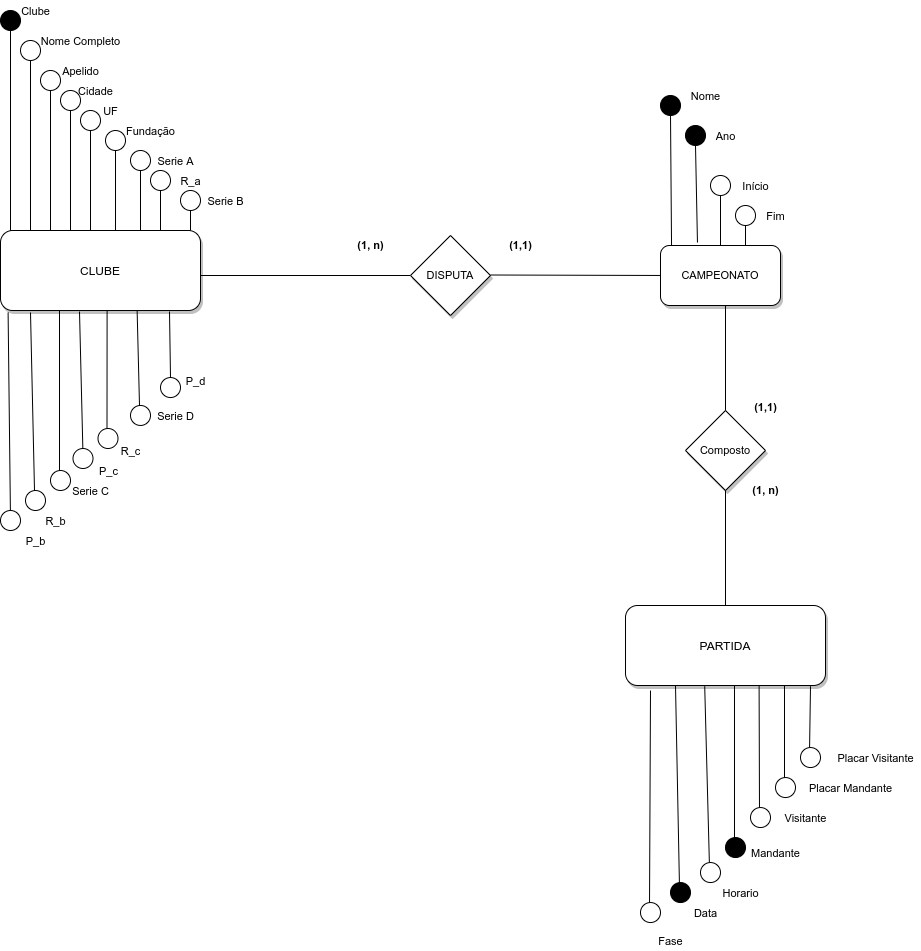
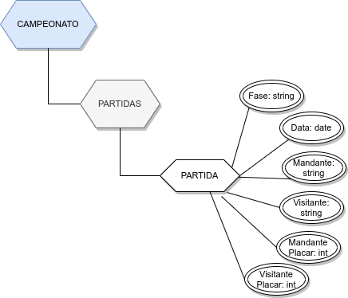
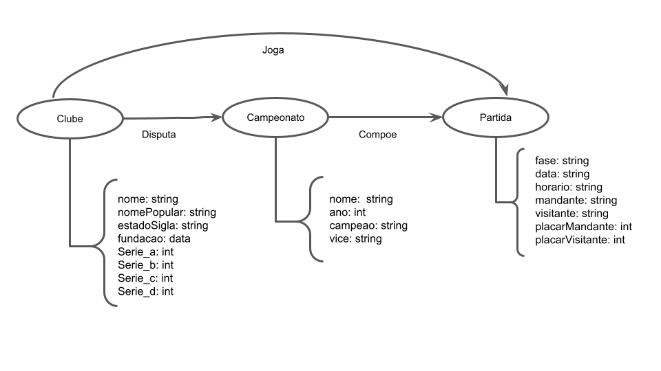

# Projeto `Campeonato Brasileiro Consolidado - Primeira Divisão`

# Equipe `Dupla de Dois` - `DDD`
* `Gustavo Mantellatto Elias` - `169366`
* `Leandro Garcia` - `178258`

## Resumo do Projeto
O Campeonato Brasileiro de Futebol é a principal competição de futebol entre clubes no país. O torneio que é hoje realizado anualmente e disputado por 20 times em um sistema de pontos corridos enfrentou diversos obstáculos para sua realização e passou por vários formatos até se tornar o que é hoje. Desde sua primeira edição em 1959, quando recebeu o nome de Taça Brasil, o torneio foi sendo disputado anualmente e incorporando mudanças ao longo do caminho, sendo a última delas em 2003, quando adotou o modelo vigente. Os nomes oficiais do Campeonato Brasileiro ao longo do tempo foram:

- Taça Brasil (1959 - 1968)
- Torneio Roberto Gomes Pedrosa (1967)
- Taça de Prata (1968 - 1970)
- Campeonato Nacional de Clubes (1971 - 1974)
- Copa Brasil (1984)
- Taça de Ouro (1985)
- Copa Brasil (1986 - 1988)
- Campeonato Brasileiro Série A (1989 - 1999; 2001 - Presente)
- Copa João Havelange (2000)
- Campeonato Brasileiro Série A (2001 - Presente)

Foi apenas em 20 de dezembro de 2010, quando a CBF por meio de nota unificou os títulos conquistados nos torneios listados acima, que todos eles passaram a ser contabilizados na contagem de campeonatos brasileiros dos clubes. Porém, pouco esforço foi feito por parte da CBF para agregar e disponibilizar os dados dos campeonatos históricos de forma consistente, de fato, não se consegue encontrar os dados sobre partidas realizadas nos campeonatos que foram unificados no site oficial da Confederação Brasileira de Futebol.
Pensando nisso, o objetivo desse projeto é consolidar e tratar os registros de partidas ocorridas nos Campeonatos Brasileiros oficiais desde 1959 em um só dataset, unindo informações presentes em repositórios sobre o sistema mais atual, com os dados de partidas encontrados em sites a serem extraídos a partir da técnica de Web Scraping. 

## Slides da Apresentação
> Coloque aqui o link para o PDF da apresentação final

## Modelo Conceitual

> 

## Modelos Lógicos

### Relacional
~~~
CLUBE(_Clube_, Nome Completo, Cidade, UF, Fundação, Serie A, R_a, Serie B, P_b, R_b, Serie C, P_c, R_c, Serie D, P_d)
PARTIDA(_Data_, _Mandante_, Horario, Visitante, Placar_mandante, Placar_visitante)
  Mandante chave estrangeira -> Clube,
  Visitante chave estrangeira -> Clube
Campeonato(_Nome_, _Ano_, Inicio, Fim)
~~~

### Hierárquico
> 

## Dataset Publicado

título do arquivo/base | link | breve descrição
----- | ----- | -----
`Partidas - Taça Brasil (1959 - 1968) .csv` | [Taça Brasil (1959 - 1968)](https://github.com/LeandroGarciaP/dddfinalproject/blob/main/final/data/processed/Partidas%20-%20Ta%C3%A7a%20Brasil%20(1959%20-%201968)%20.csv) | `Partidas Disputadas pela Taça Brasil`
`Partidas - Roberto Gomes Pedrosa (1967) ` | [1967](https://github.com/LeandroGarciaP/dddfinalproject/blob/main/final/data/processed/Partidas%20-%20Roberto%20Gomes%20Pedrosa%20(1967)%20-%20Consolidado.csv) | `Partidas do ano de 1967`
`Partidas - Taça de Prata (1968 - 1970).csv` | [Taça de Prata](https://github.com/LeandroGarciaP/dddfinalproject/blob/main/final/data/processed/Partidas%20-%20Ta%C3%A7a%20de%20Prata%20(1968%20-%201970).csv) | `<Partidas da Taça de Prata>`
`Partidas - Campeonato Nacional de Clubes (1971 - 1974).csv` | [Campeonato Nacional de Clubes](https://github.com/LeandroGarciaP/dddfinalproject/blob/main/final/data/processed/Partidas%20-%20Campeonato%20Nacional%20de%20Clubes%20(1971%20-%201974).csv) | `Partidas do Campeonato Nacional de Clubes`
`Partidas - Partidas - CopaBrasil 1975-1978.csv` | [Copa Brasil](https://github.com/LeandroGarciaP/dddfinalproject/blob/main/final/data/processed/Partidas%20-%20CopaBrasil%201975-1978.csv) | `<Partidas da Copa Brasil>`
`<Partidas - Brasileiro (1979).csv>` | [1979](https://github.com/LeandroGarciaP/dddfinalproject/blob/main/final/data/processed/Partidas%20-%20Brasileiro%20(1979).csv) | `Partidas de 1979`
`Partidas - Copa Brasil (1980, 1984, 1986).csv` | [Copa Brasil](https://github.com/LeandroGarciaP/dddfinalproject/blob/main/final/data/processed/Partidas%20-%20Copa%20Brasil%20(1980%2C%201984%2C%201986).csv) | `Partidas da Copa Brasil (1980, 1984, 1986)`
`Partidas - Copa União (1987-1988).csv` | [Copa União](https://github.com/LeandroGarciaP/dddfinalproject/blob/main/final/data/processed/Partidas%20-%20Copa%20Uni%C3%A3o%20(1987-1988).csv) | `Partidas da Copa União`
`Partidas - Brasileiro (1989).csv` | [1989](https://github.com/LeandroGarciaP/dddfinalproject/blob/main/final/data/processed/Partidas%20-%20Brasileiro%20(1989).csv) | `Partidas de 1989`
  `Partidas - Campeonato Brasilieiro Série A (1990 - 1999).csv` | [Serie A](https://github.com/LeandroGarciaP/dddfinalproject/blob/main/final/data/processed/Partidas%20-%20Campeonato%20Brasilieiro%20S%C3%A9rie%20A%20(1990%20-%201999).csv) | `Partidas Serie A`
`Partidas - Campeonato Brasileiro (2000 - 2021).csv` | [Brasileirão](https://github.com/LeandroGarciaP/dddfinalproject/blob/main/final/data/processed/Partidas%20-%20Campeonato%20Brasileiro%20(2000%20-%202021).csv) | `Pontos Corridos`
`clubes_final.csv` | [Clubes](https://github.com/LeandroGarciaP/dddfinalproject/blob/main/final/data/processed/clubes_final.csv) | `Lista de Clubes`

## Bases de Dados
> Elencar as bases de dados fonte utilizadas no projeto.

título da base | link | breve descrição
----- | ----- | -----
`Ogol` | [www.ogol.com.br](https://www.ogol.com.br/) | `Um site com infomações de competições de futebol nacional e internacional. Mais importante, com o histórico de todos os torneios nacionais desde 1959. A técnica utilizada para extração de dados será o web scrapping com auxílio de bibliotecas do python.`
`Brasileirão Dataset` | [github.com/adaoduque/Brasileirao_Dataset](https://github.com/adaoduque/Brasileirao_Dataset) | `Dataset aberto independente com as partidas do campeonato brasileiro no período de pontos corridos. Os dados precisam passar por tratamento para se adequar ao modelo proposto pelo grupo, que acredita ser mais adequado pois simplifica as tabelas ao mesmo tempo que acomoda mais informações.`
`Wikipedia` | [wikipedia.com](www.wikipedia.com) | `Informações dos clubes e suas participações nos torneios nacionais serão extraídas aqui utilizando web scrapping e bibliotecas do python.`
`DBPedia` | [dbpedia.org](https://www.dbpedia.org/) | `Informações complementares dos 521 clubes foram extraídas da DBPedia, um projeto que extrai informação estruturada da Wikipedia e disponibiliza na Web.`

## Detalhamento do Projeto
> A inspiração para o desenvolvimento do projeto se deu justamente pelo fato da ausência de dados estruturados dos campeonatos alvo, sendo assim, sua construção teve como base a extração de dados de páginas não estruturadas. Para isso, o grupo utilizou da técnica de `Web scrapping` para recuperar as informações desejadas dos sites utilizados como fonte. 

### Método de Extração da Tabela de Clubes da Wikipédia (scrapwiki.py)
> Através Wikipédia, obtemos uma tabela com todos os clubes que disputaram um campeonato nacional pelo menos uma vez desde 1959, bem como a quantidade de vezes que a disputaram e suas respectivas promoções / rebaixamentos à outras divisões.
~~~python
wiki_url = 'https://pt.wikipedia.org/wiki/Participa%C3%A7%C3%B5es_dos_clubes_no_Campeonato_Brasileiro_de_Futebol'

name = 'wikitable sortable'

response = requests.get(wiki_url)

soup = BeautifulSoup(response.text, 'html.parser')

#tabela dos clubes
teams_table = soup.find('table',{'class':name})
~~~

> Também extraímos da Wikipédia as referências aos clubes para serem usadas posteriormente como consultas à uma fonte estruturada como a DBPedia, essas consultas resultaram na coleta de informações complementares que auxiliaram a construir nossa tabela de Clubes.

~~~python
#cria lista com todos os links da tabela
for a in teams_table.find_all('a', href=True):
    if a.text:
        links.append(a['href'])
~~~
~~~python
#limpa a lista deixando apenas a parte que interessa dos links e apenas dos clubes
for i in range(4, len(links), 2):
    concepts.append(links[i][6:])      #retira os 6 primeiros char da lista "links"
~~~
> De posse dos links, exportamos para um arquivo csv que posteriormente será usado para realizar as consultas à DBPedia.

~~~python
dict = {'Reference': concepts}
df1 = pd.DataFrame(dict)
df1.to_csv('dbconcepts.csv', index=False)
~~~
> Ao final da execução, teremos o arquivo `clubes_raw.csv` contendo os dados da tabela bruta, dois arquivos `links_v0.csv` e `links_v1.csv` (contidos dentro de '/data/raw') sendo o primeiro sem nenhum tratamento e o segundo com a adição de um link faltante no site e remoção de comentários que integravam a tabela. Por fim, o arquivo `dbconcepts.csv` ('/data/external') é criado com as referências a serem utilizadas para busca dos recursos posteriormente na DBPedia.

 

### Método de Consulta à DBPedia (dbpediascrap.py)
> Nesse modelo, utilizamos os 521 `concepts` extraídos da tabela da Wikipédia no modelo _scrapWiki_ para realizar consultas individuais à DBPedia, a fim de recuperar informações complementares a respeito de todos os clubes da tabela.

> Aqui, as 521 consultas buscavam encontrar, para cada clube, seu `Nome Completo`, `Apelido` e `Data de Fundação`, sendo a maioria das consultas bem sucedidas. Dois problemas foram encontrados durante o procedimento de extração de dados:
> * Página da DBPedia com arquivo JSON corrompido: "SyntaxError: JSON.parse"
> * Página do recurso encontrada mas incorreta ou sem as informações
> 
> Nesses casos, o modelo apenas continua a consulta preenchendo as informações do respectivo clube com "-"

~~~python
#Laço percorrendo todos os recursos da DBPedia e obtendo as infos desejadas
for i in range(0, len(teams)):
    flag = True
    url_template = "http://dbpedia.org/data/{concept}.{format}"
    concept = teams[i]
    format = "jsod"
    concept = concept.replace(" ", "_")
    url = url_template.replace("{concept}", concept).replace("{format}", format)
    data = requests.get(url)
~~~

> Ao final da execução, um arquivo csv `'dbpedia_scrap.csv'`('/data/interm/') é gerado com os dados recuperados, ele será unido junto ao `clubes_raw.csv`.

 

### Método de Extração das Partidas (Modelo Web Scraping.py)
> É aqui que se concentra a maior quantidade de dados extraída, a tabela html da fonte de extração de dados era consideravelmente mais complexa do que a encontrada na Wikipédia, além disso, o site também possuia um mecanismo para realizar bloqueios quando muitos acessos seguidos eram realizados.

~~~python
for url in urls:
    browser = webdriver.Chrome('C:\chromedriver.exe')
    browser.get(url)
    time.sleep(3)
    browser.refresh()
    html = browser.page_source
    soup = BeautifulSoup(html,'html.parser')
    time.sleep(5)
    browser.close()
    gdp = soup.find_all("table", attrs={"class": "zztable stats"})
    table1 = gdp[0]
    body = table1.find_all("tr")
    head = body[0]
    body_rows = body[1:]
    headings = []
~~~

### Arquivos Utilizados para tratamento de Dados:
* `clubes_join.py`: Unificação dos arquivos csv contendo informações dos clubes que disputaram os campeonatos cobertos pelo banco.
* `trat_brasileirao.py`: tratamento dos dados obtidos no github para os campeonatos de 2000-2021.

#### Tratamento Clubes (clubes_join.py)
Aqui, o objetivo é unificar as duas tabelas com informações dos clubes extraídas da Wikipédia e da DBPedia, para isso, foi utilizada a biblioteca pandas para criação e concatenação dos dataframes, além das alterações no nome e ordenaçao das colunas.

#### Tratamento Partidas (trat_brasileirao.py)
Essa rotina trata os arquivos obtivos através do dataset público do github utilizado como fonte, aqui o tratamento ocorreu da seguinte forma:

**Expansão das Colunas do DataFrame:** O dataframe original encontra-se apenas uma coluna e todos os dados de uma partida concentrados em uma única célula, o objetivo passa a ser expandir esse conteúdo de forma a facilitar sua manipulação e visualização.

~~~python
df_brasileirao[['ID', 'Rodada', 'Data', 'Horário', 'Dia', 'Mandante', 'Visitante', 
    'Vencedor', 'Arena', 'Mandante Placar', 'Visitante Placar', 'Estado Mandante', 
        'Estado Visitante', 'Estado Vencedor']] = df_brasileirao['ID;Rodada;Data;Horário;Dia;Mandante;Visitante;Vencedor;Arena;Mandante Placar;Visitante Placar;Estado Mandante;Estado Visitante;Estado Vencedor'].str.split(';', expand=True)
~~~

**Deleção das Células Antigas:** Uma vez expandido, a informação em formato menos otimizado pode ser removida.

**Deleção de Informação Redundante:** Colunas com informações redundantes que podem ser obtidas através de queries, como `Estado`, `Clube Vencedor` foram removidas a fim de otimizar a utilização de espaço dos dados.

**Renomeação de Colunas:** Para seguir o padrão do restante do banco de dados, as colunas foram renomeadas.

 

## Evolução do Projeto
> Desde o início do desenvolvimento do projeto, estava bem claro que um dos modelos utilizados seria o relacional, seja pela associatividade quase que imediata do próprio tema do projeto com um sistema de tabelas, ou pelo maior detalhamento que esse modelo recebeu em sala, possibilitando com que nos sentissemos mais à vontade ao utilizá-lo. Porém sua construção sofreu alterações no decorrer do desenvolvimento, de início, foi projetado um modelo simples com apenas uma entidade, que agragaria todas as informações extraída:

~~~
PARTIDA('ID;Rodada;Data;Horário;Dia;Mandante;Visitante;Mandante Placar;Visitante Placar;Estado Mandante;Estado Visitante;)
~~~

>Mas percebemos que a criação de outras entidades nos possibilitaria além de simplificar a visualização, enriquecer a nossa base de dados com informações relevantes. Uma entidade dedicada à todos os clubes permitiria que além de seu estado de origem, o nosso dataset pudesse guardar sua cidade, sua data de fundação e suas participações/promoções/delegações à outras divisões. 
> Durante a fase de extração de dados,todo o processo serviu como um grande aprendizado ao grupo. A técnica de Web scrapping não era familiar aos integrantes no início do desenvolvimento e conhecê-la e aplicá-la na pŕatica foi sem dúvida uma experiência positiva. Porém, enfrentamos algumas dificuldades nessa etapa que acabou resultado em um atraso do grupo: A página web de onde tentávamos extrair as informações possuía sistemas restritivos como a obrigatoriedade da aceitação dos cookies e um bloqueio à acessos consecutivos. Superar essa situação foi um desafio recompensador.

> O segundo modelo lógico a ser utilizado também sofreu mudanças, de início o grupo optou por entrar no modelo de grafos, mas sentiu dificuldades tanto em modela-lo quanto em utlizá-lo propriamente, aproveitando de suas vantagens.
 
> 
> Antigo modelo de um grafo de propriedades proposto.

 

## Perguntas de Pesquisa/Análise Combinadas e Respectivas Análises

> Apresente os resultados da forma mais rica possível, com gráficos e tabelas. Mesmo que o seu código rode online em um notebook, copie para esta parte a figura estática. A referência a código e links para execução online pode ser feita aqui ou na seção de detalhamento do projeto (o que for mais pertinente).

> Liste aqui as perguntas de pesquisa/análise e respectivas análises. Nem todas as perguntas precisam de queries que as implementam. É possível haver perguntas em que a solução é apenas descrita para demonstrar o potencial da base. Abaixo são ilustradas três perguntas, mas pode ser um número maior a critério da equipe.
>
### Perguntas/Análise com Resposta Implementada

#### Pergunta/Análise 1
> * Qual o time com maior número de gols marcados/sofridos na história do Campeonato Brasileiro?
>   
>   * Essa pergunta pode ser respondida ao somar todos os placares como mandante/visitante, agrupando com a ferramenta groupby do Pandas para cada Clube.
>   ~~~python
>      gols_mandante_clube = df.groupby('mandante')['placar_mandante'].sum().sort_values(ascending=False).reset_index()
>      gols_mandante_clube.rename(columns  = {"mandante" : "clube", 'placar_mandante' : 'gols' }, inplace=True)
>      gols_visitante_clube = df.groupby('visitante')['placar_visitante'].sum().sort_values(ascending=False).reset_index()
>      gols_visitante_clube.rename(columns = {"visitante": "clube", 'placar_visitante': 'gols' }, inplace=True)
>      gols_clube = pd.concat([gols_mandante_clube,gols_visitante_clube])
>      gols_marcados_clube = gols_clube.groupby('clube')['gols'].sum().sort_values(ascending=False).reset_index()
>      ~~~
>     Com isso, temos o resultado a seguir:
>     
>     
> 
>     

#### Pergunta/Análise 2
> * Qual o desempenho de um Clube como mandante/visitante em toda a história do Campeonato Brasileiro?
>   Essa pergunta é possível de ser respondida pois podemos utilizar primeiramente as queries para Mandante e ir aumentando os filtros conforme desejado, como por exemplo
>   com relação as vitórias. Portanto, para buscar uma informação específica sobre um clube basta utilizar uma sequência de queries semelhantes a seguinte:
>   ~~~~python
>   fec = df.query('mandante=="Fortaleza"')
>   fecvit = df.query('mandante=="Fortaleza" & placar_mandante>placar_visitante')
>   ~~~~
>   Após essas 2 requisições, além de poder ver todos os placares de vitória do time Fortaleza, também é possível verificar que ele venceu 113 das suas 240 partidas como
>   mandante (resultados das queries) e, portanto, tem 47% de vitórias jogando em casa.
>   A seguir, a tabela com "todas" as vitórias do Fortaleza:
>   
>   * 
>     

#### Pergunta/Análise 3
> * Considerando a pandemia de covid, houve uma grande diferença d
>   
>   * Explicação sucinta da análise que será feita e conjunto de queries que
>     responde à pergunta.

### Perguntas/Análise Propostas mas Não Implementadas

#### Pergunta/Análise 1
> * Probabilidade de ser campeão
>   
>   * Considerando a disputa do campeonato por meio de pontos corridos, é possível fazer uma predição de quais as chances um time tem de ser campeão de acordo com a sua
>   atual pontuação e com uma comparação com os campeões dos anos anteriores.

#### Pergunta/Análise 2
> * Número de títulos por região
>   
>   * É possível responder a essa pergunta fazendo um tratamento diferente nos dados e definindo o conceito de "região". Como temos a localidade de todos os clubes, além do
>   número de títulos de cada um, conseguiríamos fazer esse tipo de análise.

#### Pergunta/Análise 3
> * Maior número de vitórias em partidas na história equivale a maior número de títulos?
>   
>   * Podemos fazer um cruzamento dos dados de vitórias de um clube ao longo da história e compará-lo ao seu número de títulos. Será que necessariamente o que tem mais vitórias
>   é o maior campeão? Como o número de títulos é um dado do nosso dataset, bastaria contabilizar as vitórias de cada clube para fechar a observação.

> [Requisições](https://github.com/LeandroGarciaP/dddfinalproject/blob/main/final/notebooks/Requisi%C3%A7%C3%B5es%20e%20queries.ipynb)
