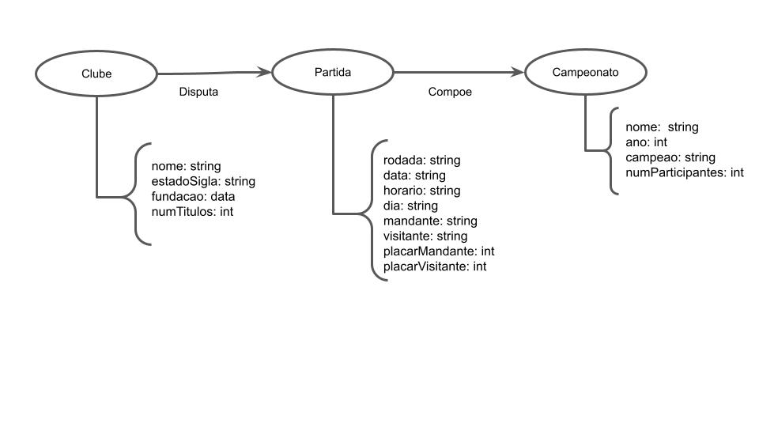

# Lab 08 - Modelo Lógico e Análise de Dados em Grafos

# Equipe Joga Bonito - SOFUT

- `Gustavo Mantellatto Elias` - `169366`
- `Leandro Garcia` - `178258`

# Modelo Lógico Combinado do Bando de Dado de Grafos

# Perguntas de Pesquisa / Análise Combinadas

## Pergunta / Análise 1
>Qual região do país tem o maior número de títulos de Campeonato Brasileiro antes e depois da unificação?
> * Para responder essa questão precisamos determinar o número de conquistas em cada estado da Federação e realizar uma transformação em nossa rede para criar uma comunidade entre os estados relacionados para que enfim possamos comparar os resultados.

## Pergunta / Análise 2
> Qual equipe disputou mais vezes o Campeonato Brasileiro?
>  * Essa questão pode ser resolvida através de uma análise de centralidade de grau sobre as partidas de cada edição da competição, procurando por ocorrências das equipes com o objetivo de identificar sua participação.

## Pergunta / Análise 3
> Considerando a edição do campeonato deste ano - ainda em andamento - e que determinado time possui X pontos em determinada rodada do campeonato, qual a probabilidade desse time ser campeão do torneio?
>  * Para essa questão, devemos fazer uma análise de predição, usando como base times de edições anteriores que possuiam a mesma, maior e menor quantidade de pontos na mesma rodada do torneio e em que colocação esses respectivos times terminaram a competição.
