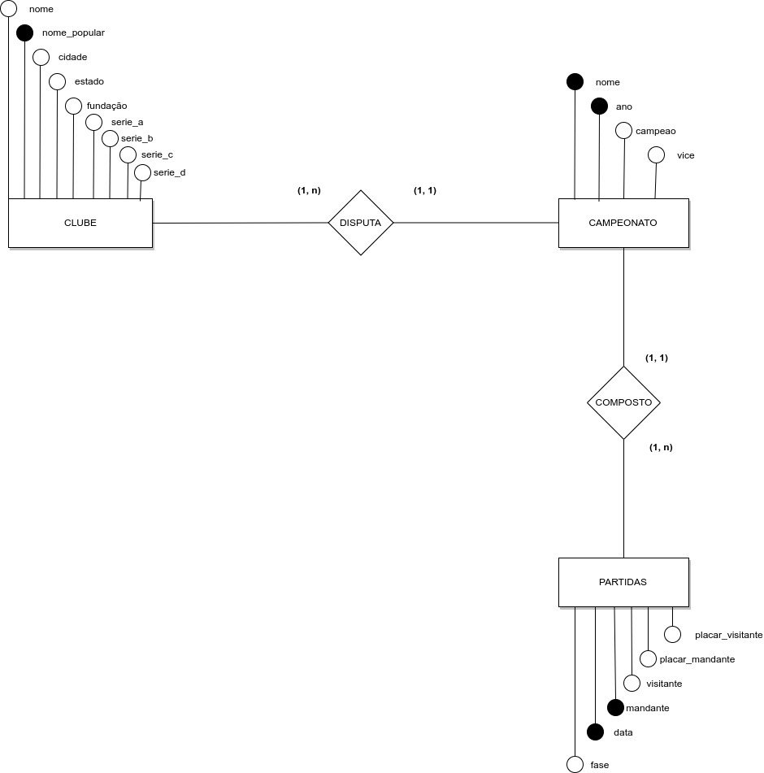
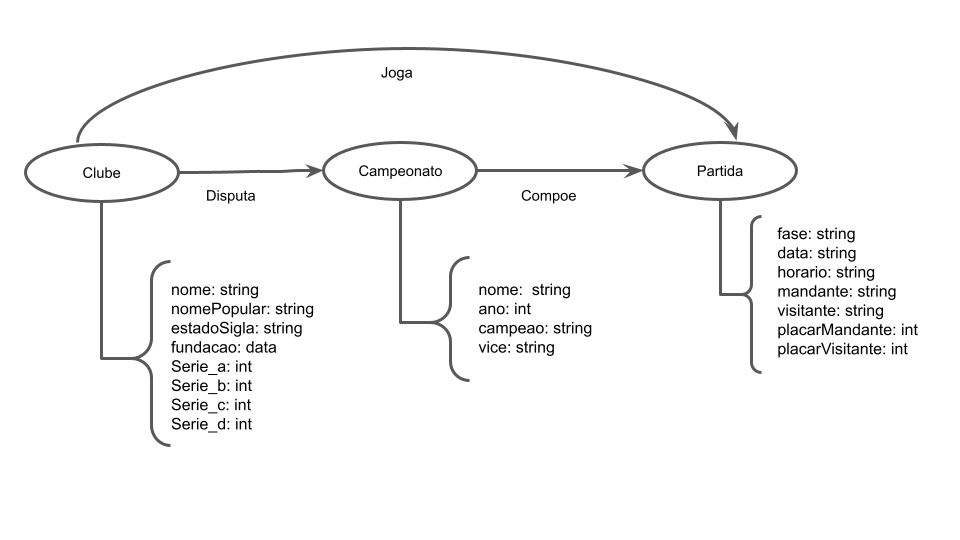

# Projeto `Campeonato Brasileiro Consolidado - Primeira Divisão`

# Equipe `Bomba Patch` - `FUT`
* `Gustavo Mantellatto Elias` - `169366`
* `Leandro Garcia` - `178258`

## Resumo do Projeto
O Campeonato Brasileiro de Futebol é a principal competição de futebol entre clubes no país. O torneio que é hoje realizado anualmente e disputado por 20 times em um sistema de pontos corridos enfrentou diversos obstáculos para sua realização e passou por vários formatos até se tornar o que é hoje. Desde sua primeira edição em 1959, quando recebeu o nome de Taça Brasil, o torneio foi sendo disputado anualmente e incorporando mudanças ao longo do caminho, sendo a última delas em 2003, quando adotou o modelo vigente. Os nomes oficiais do Campeonato Brasileiro ao longo do tempo foram:

- Taça Brasil (1959 - 1968)
- Torneio Roberto Gomes Pedrosa (1967)
- Taça de Prata (1968 - 1970)
- Campeonato Nacional de Clubes (1971 - 1974)
- Copa Brasil (1984)
- Taça de Ouro (1985)
- Copa Brasil (1986 - 1988)
- Campeonato Brasileiro Série A (1989 - 1999; 2001 - Presente)
- Copa João Havelange (2000)
- Campeonato Brasileiro Série A (2001 - Presente)

Foi apenas em 20 de dezembro de 2010, quando a CBF por meio de nota unificou os títulos conquistados nos torneios listados acima, que todos eles passaram a ser contabilizados na contagem de campeonatos brasileiros dos clubes. Porém, pouco esforço foi feito por parte da CBF para agregar e disponibilizar os dados dos campeonatos históricos de forma consistente, de fato, não se consegue encontrar os dados sobre partidas realizadas nos campeonatos que foram unificados no site oficial da Confederação Brasileira de Futebol.
Pensando nisso, o objetivo desse projeto é consolidar e tratar os registros de partidas ocorridas nos Campeonatos Brasileiros oficiais desde 1959 em um só dataset, unindo informações presentes em repositórios sobre o sistema mais atual, com os dados de partidas encontrados em sites a serem extraídos a partir da técnica de Web Scraping. 

## Slides da Apresentação
> [Prévia - Slides](https://github.com/LeandroGarciaP/dddfinalproject/blob/main/previa/slides/Apresenta%C3%A7%C3%A3o%20pr%C3%A9via.pdf)

## Modelo Conceitual Preliminar

> Coloque aqui a imagem do modelo conceitual preliminar em ER ou UML, como o exemplo a seguir:
> 

## Modelos Lógicos Preliminares

### Relacional
~~~
CLUBE(_Nome_popular_, Nome, Cidade, Estado, Fundação, Serie_a, Serie_b, Serie_c, Serie_d)
PARTIDA(_Data_, _Mandante_, Visitante, Placar_mandante, Placar_visitante)
  Mandante chave estrangeira -> Clube,
  Visitante chave estrangeira -> Clube
Campeonato(_Nome_, _Ano_, Campeão, Vice)
  Campeão chave estrangeira -> Clube,
  Vice chave estrangeira -> Clube,
~~~

### Grafo de Propriedades
> 

## Dataset Preliminar a ser Publicado
> Elencar os arquivos/bases preliminares dos datasets serão publicados publicados.

título do arquivo/base | link | breve descrição
----- | ----- | -----
`<título do arquivo/base>` | `<link para arquivo/base>` | `<breve descrição do arquivo/base>`

> Os arquivos finais do dataset publicado devem ser colocados na pasta `data`, em subpasta `processed`. Outros arquivos serão colocados em subpastas conforme seu papel (externo, interim, raw). A diferença entre externo e raw é que o raw é em formato não adaptado para uso. A pasta `raw` é opcional, pois pode ser substituída pelo link para a base original da seção anterior.
> Coloque arquivos que não estejam disponíveis online e sejam acessados pelo notebook. Relacionais (usualmente CSV), XML, JSON e CSV ou triplas para grafos.

## Bases de Dados
> Elencar as bases de dados fonte utilizadas no projeto.

título da base | link | breve descrição
----- | ----- | -----
`Ogol` | [www.ogol.com.br](https://www.ogol.com.br/) | `Um site com infomações de competições de futebol nacional e internacional. Mais importante, com o histórico de todos os torneios nacionais desde 1959. A técnica utilizada para extração de dados será o web scrapping com auxílio de bibliotecas do python.`
`Brasileirão Dataset` | [github.com/adaoduque/Brasileirao_Dataset](https://github.com/adaoduque/Brasileirao_Dataset) | `Dataset aberto independente com as partidas do campeonato brasileiro no período de pontos corridos. Os dados precisam passar por tratamento para se adequar ao modelo proposto pelo grupo, que acredita ser mais adequado pois simplifica as tabelas ao mesmo tempo que acomoda mais informações.`
`Wikipedia` | [wikipedia.com](www.wikipedia.com) | `Informações dos clubes e suas participações nos torneios nacionais serão extraídas aqui utilizando web scrapping e bibliotecas do python.`

## Operações realizadas para a construção do dataset

> Coloque um link para o arquivo do notebook, programas ou workflows que executam as operações de construção do dataset:
* extração de dados de fontes não estruturadas como, por exemplo, páginas Web
* agregação de dados fragmentados obtidos a partir de API
* integração de dados de múltiplas fontes
* tratamento de dados
* transformação de dados para facilitar análise e pesquisa

> Se for notebook, ele estará dentro da pasta `notebook`. Se por alguma razão o código não for executável no Jupyter, coloque na pasta `src`. Se as operações envolverem queries executadas atraves de uma interface de um SGBD não executável no Jupyter, como o Cypher, apresente na forma de markdown.

## Perguntas de Pesquisa/Análise Combinadas e Respectivas Análises

> Liste aqui as perguntas de pesquisa/análise e respectivas análises.
> Nem todas as perguntas precisam de queries que as implementam.
> É possível haver perguntas em que a solução é apenas descrita para
> demonstrar o potencial da base.
>
### Pergunta/Análise 1
> * Pergunta 1
>   
>   * Explicação sucinta da análise que será feita ou conjunto de queries que
>     responde à pergunta.

### Pergunta/Análise 2
> * Pergunta 2
>   
>   * Explicação sucinta da análise que será feita ou conjunto de queries que
>     responde à pergunta.

### Pergunta/Análise 3
> * Pergunta 3
>   
>   * Explicação sucinta da análise que será feita ou conjunto de queries que
>     responde à pergunta.

> Coloque um link para o arquivo do notebook que executa o conjunto de queries. Ele estará dentro da pasta `notebook`. Se por alguma razão o código não for executável no Jupyter, coloque na pasta `src`. Se as queries forem executadas atraves de uma interface de um SGBD não executável no Jupyter, como o Cypher, apresente na forma de markdown.
